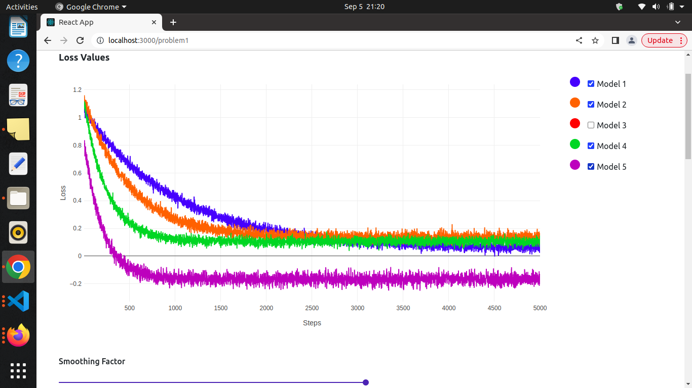
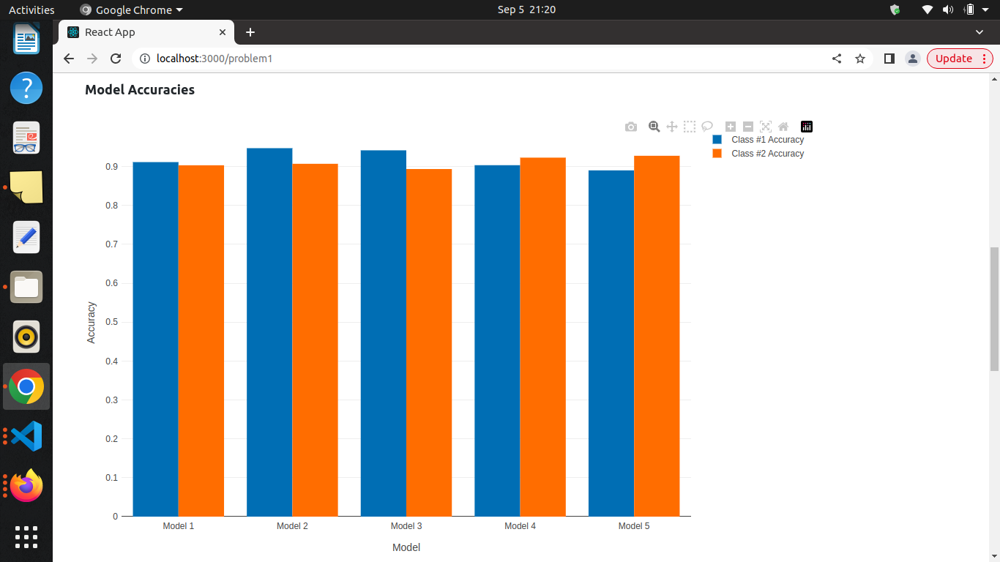
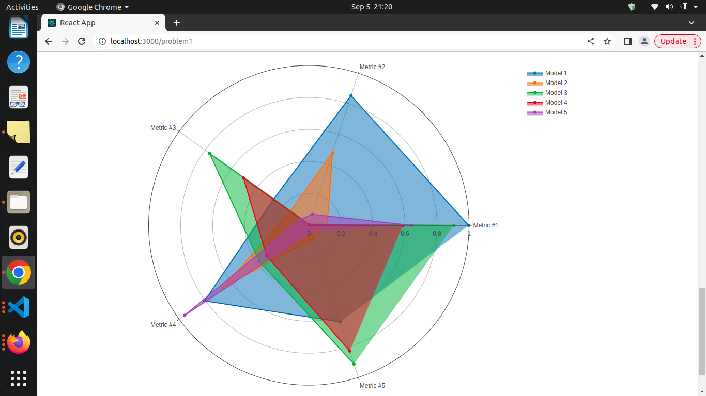

## Problem Statement 

https://github.com/priyathamkat/frontend-questions

## How to run the project 

- Clone the github repository : https://github.com/tarang1998/relai-frontend.git
- Open the terminal and cd to the folder : relai-frontend
- Run Commnand : 1> npm install 2> npm start

## Solution Images 

- 
- 
- 
- 